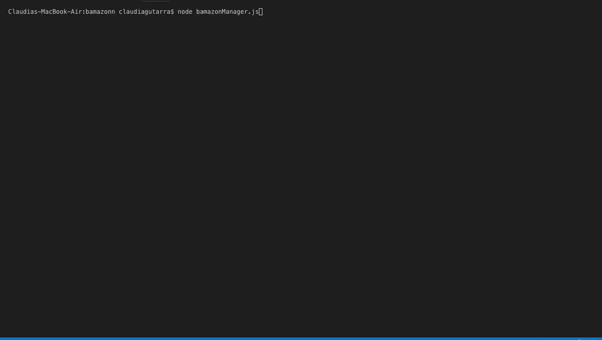
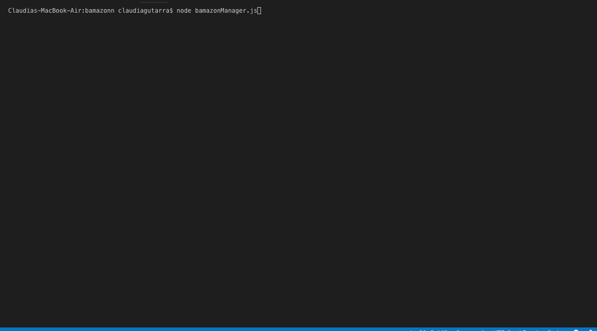

# bamazonn

<h1> Bamazon App </h1>
<h3> Here is how it works: </h3>
<h5> BamazonCustomer </h5>

 The customer would be able to enter the ID of the product they'd like to buy, as well as the number of products they'd like to buy. If there aren't enough, then the app would let them know that there is an insufficient quantity: 

<h5> BamazonManager </h5>

 The manager would be able to view all of the products' information:

 The manager would also be able to see which products are low in inventory. (If the product has a quantity of 5 or lower, then the item will appear after the command): 

 They would also have the option to add inventory. This will update the database: 

 Lastly, the manager would be able to add a new product into the database: 

